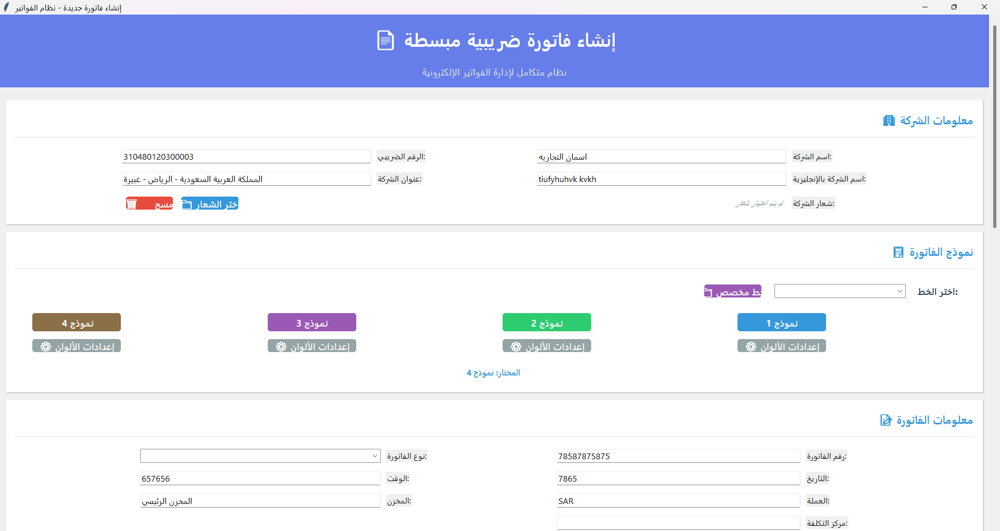
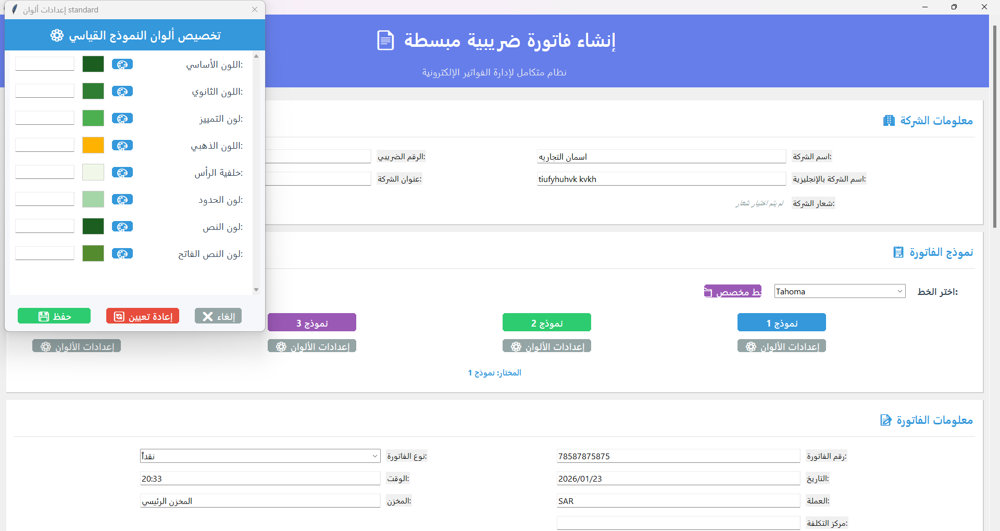
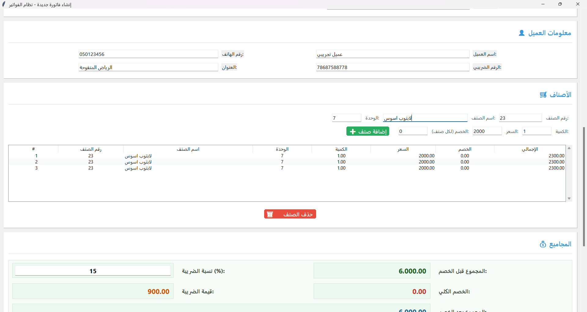
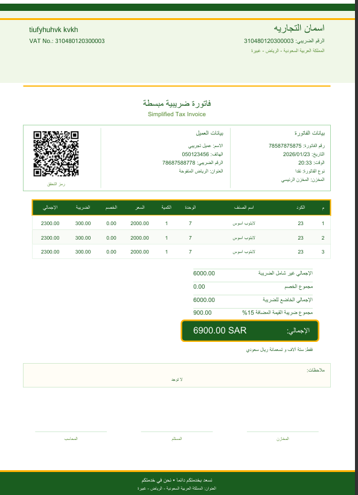
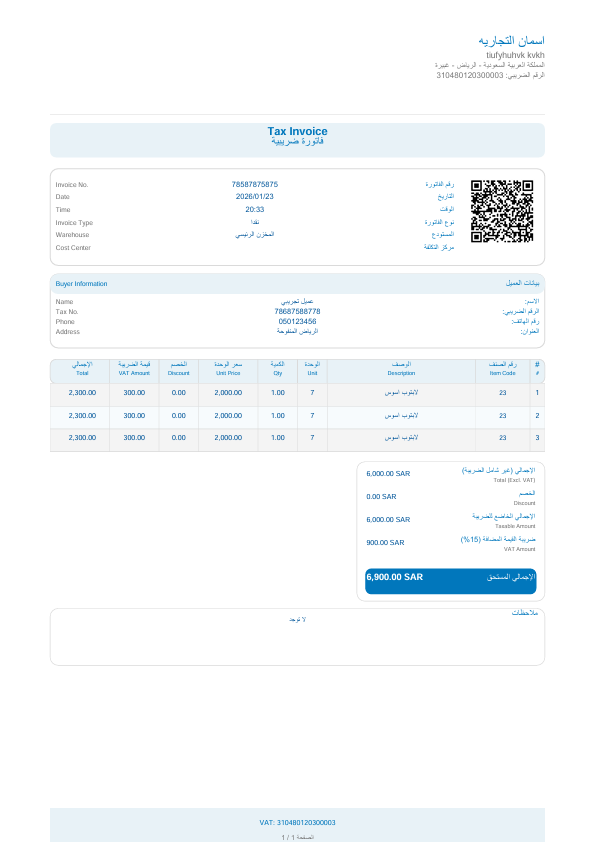
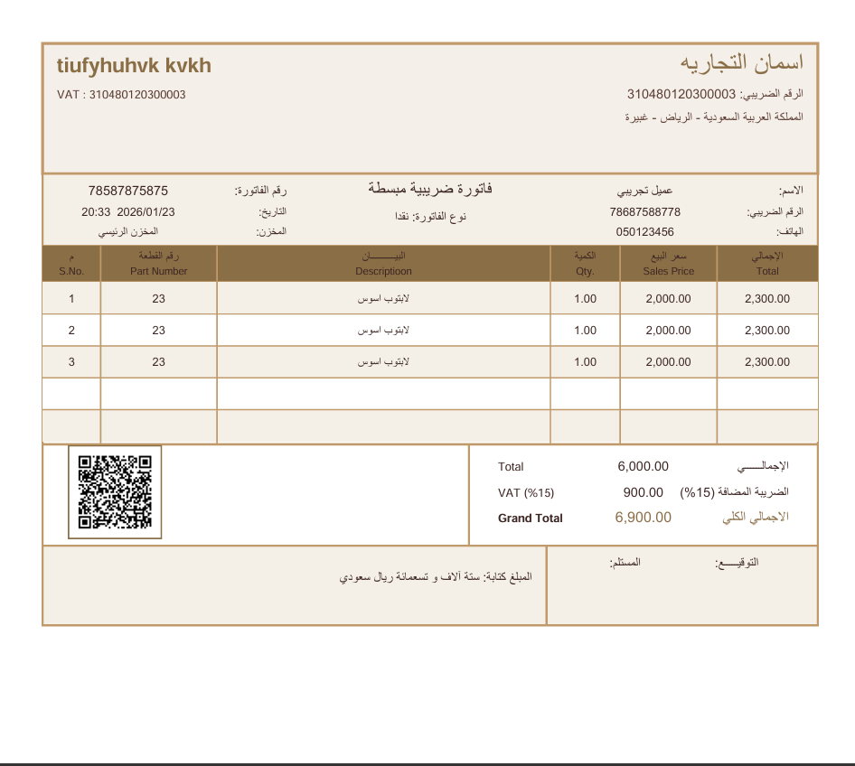
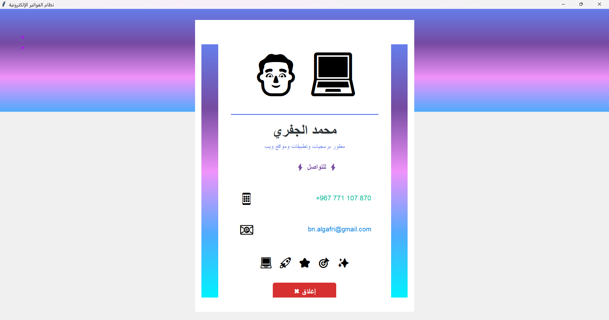

# تطبيق طباعة الفواتير - Invoice Printer

تطبيق لطباعة الفواتير باللغة العربية مع دعم الحسابات الضريبية.

## تنبيه

هذا التطبيق للأغراض التعليمية فقط.

## الميزات

- واجهة رسومية بـ Tkinter
- دعم اللغة العربية (RTL)
- 4 نماذج فواتير
- توليد QR codes
- تصدير PDF
- ألوان قابلة للتخصيص
- حسابات ضريبية
- قاعدة بيانات SQLite

## المتطلبات

```bash
pip install -r requirements.txt
```

المكتبات: `reportlab`, `pillow`, `python-bidi`, `arabic-reshaper`, `qrcode`, `num2words`

## كيفية الاستخدام

```bash
git clone https://github.com/maknedo/invoice_app.git
cd invoice_app
python -m venv venv
venv\Scripts\activate
pip install -r requirements.txt
python main.py
```

1. أدخل بيانات الشركة والعميل
2. أضف الأصناف (الكمية، السعر، الخصم)
3. اختر نموذج الفاتورة
4. اطبع أو صدر PDF

## بنية المشروع

```
invoice_app/
├── main.py
├── invoice_gui.py
├── invoice_calculator.py
├── invoice_validation.py
├── invoice_settings.py
├── qr_generator_gui.py
├── ui_components.py
├── welcome.py
├── invoice_templates/
├── images/
├── requirements.txt
└── README.md
```

## لقطات الشاشة

  |  
:-------------------------:|:-------------------------:
  |  
  |  
  |  


## نماذج الفواتير

- Standard - نموذج أساسي
- Simple - نموذج مبسط
- Professional - نموذج احترافي
- Rawayih - نموذج روائح بيتك

## الترخيص

MIT License
